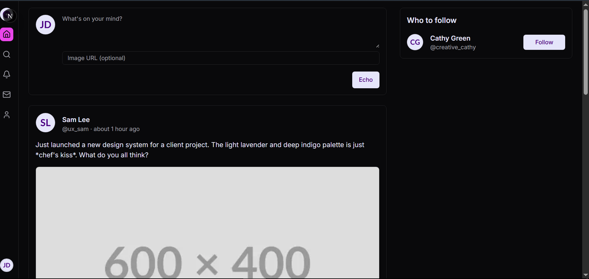
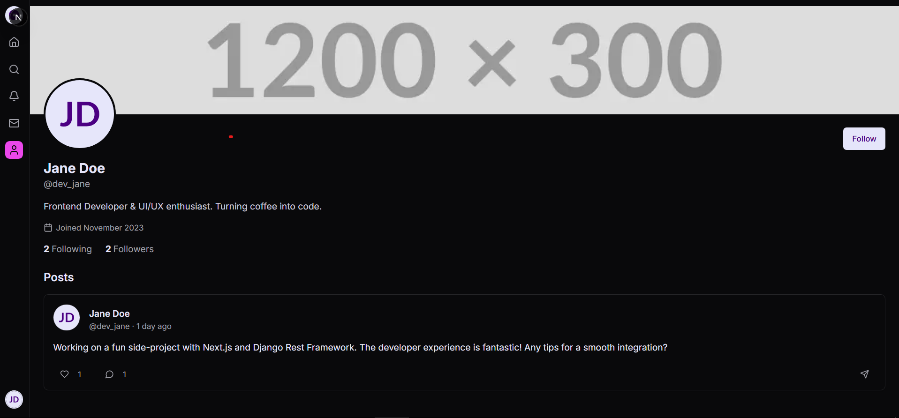

# Social Media App

# Home Page

# Profile Page

 

Feel free to contribute to this repository by adding code samples, tutorials, or helpful resources related to Programming Fundamentals. Create pull requests, report issues, and collaborate with the community!

Happy coding! 🐍🚀

***
### 📝 Writer : Muhammad Bilal Ashiq 

 

  
  
    
    
  

